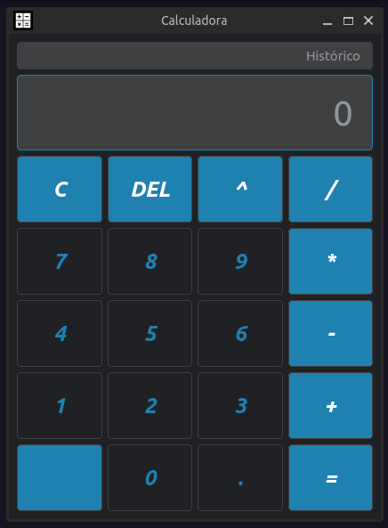

# Calculadora em Python com PySide6 e QT6

Este é um projeto de uma calculadora desenvolvida em Python utilizando a biblioteca PySide6 e o framework QT6. A calculadora fornece uma interface gráfica intuitiva e funcional para realizar operações matemáticas básicas.

## Recursos

- Interface gráfica amigável e responsiva.
- Suporte para operações matemáticas básicas, incluindo adição, subtração, multiplicação e divisão.
- Possibilidade de realizar cálculos com números inteiros e decimais.
- Exibição dos resultados em tempo real na tela da calculadora.
- Botão de limpar para reiniciar a calculadora.
- Funcionalidades adicionais podem ser implementadas de acordo com as necessidades do usuário.

## Pré-requisitos

Antes de executar o projeto, certifique-se de ter o Python instalado em sua máquina. Além disso, você precisa instalar as seguintes dependências:

- PySide6: `pip install PySide6`

## Executando a Calculadora

1. Clone o repositório para o seu ambiente local.
2. Navegue até o diretório do projeto: `cd calculadora`.
3. Execute o arquivo `main.py`: `python main.py`.
4. A calculadora será iniciada e você poderá começar a utilizá-la.

## Contribuindo

Contribuições são bem-vindas! Se você deseja melhorar ou adicionar recursos à calculadora, sinta-se à vontade para enviar um pull request. Certifique-se de seguir as diretrizes de contribuição do projeto.
